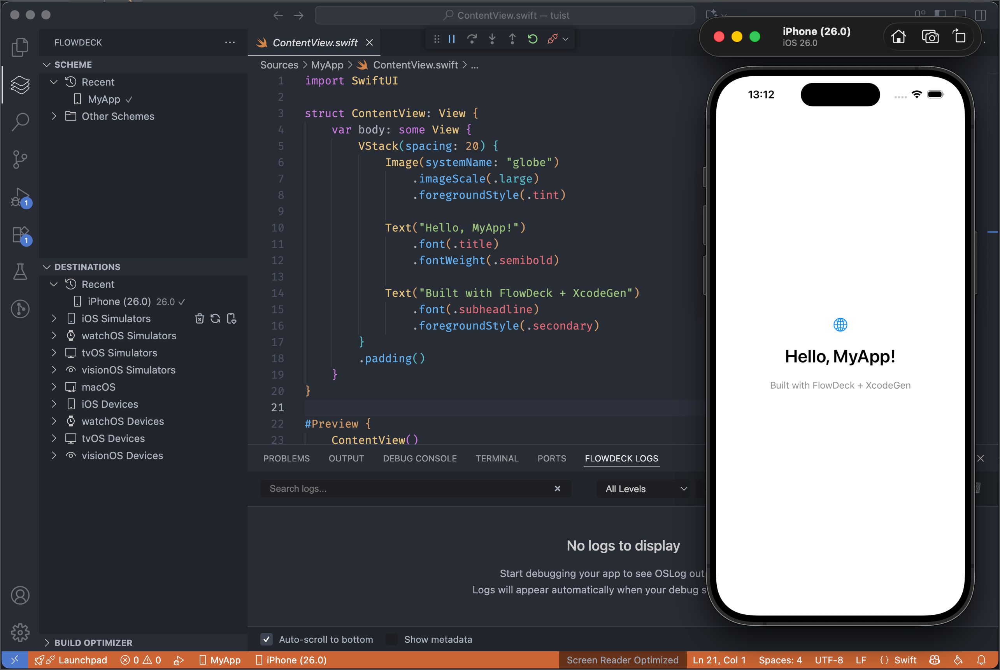

Welcome to **FlowDeck**, the best alternative to XCode for professionals. This documentation will help you understand and make the most of Flodeck's features.

## Essentials

<CardGroup cols={2}>
  <Card title="Install and Setup" icon="rocket" iconType="regular">
    Flowdeck works in any VSCode-based editor, including Cursor and Windsurf.  Here's how to set it up.
  </Card>
  <Card title="The basics" icon="sparkles">
    Get code completion working and learn how to build and run your iOS and macOS apps, or create a new one from scratch.
  </Card>
</CardGroup>

### Requirements

<Warning>
  FlowDeck requires macOS with Xcode installed. It does not support Windows or Linux.
</Warning>

- **macOS** 13.0 or later
- **Xcode** 15.0 or later (with command line tools)
- **VS Code, Cursor or Windsurf**
- **iOS 17+ Device**: Required for devicectl (physical device debugging)

## Core Features

<CardGroup cols={2}>
  <Card title="Code Intelligence" icon="code">
    Real-time auto-complete, suggestions, and Symbol navigation support via SourceKit LSP.,
  </Card>
  <Card title="Build, Run and Deploy" icon="hammer" href="/features/build">
    ,Build and run existing XCode projects from VSCode
  </Card>
  <Card title="Device & Simulator Support" icon="mobile" href="/features/devices">
    Deploy and test your apps to simulators and physical Apple devices
  </Card>
  <Card title="LLDB Debugging" icon="bug" href="/features/debugging">
    Debug with breakpoints and variable inspection
  </Card>
</CardGroup>

## Pro Features

<Note>
  FlowDeck is in Beta - All pro features are unlocked for testing 🎉
</Note>

<CardGroup cols={2}>
  <Card title="Full Test Runner" icon="flask" href="/features/testing">
    Run and manage your Unit and UI tests from VS Code.
  </Card>
  <Card title="OSLog Integration" icon="file-lines">
    Stream, search, and filter simulator logs directly from VSCode
  </Card>
  <Card title="Build Optimizer" icon="rocket" iconType="regular">
    30% faster builds than other open-source editors, via a custom Build Helper for macOS.
  </Card>
</CardGroup>

## Getting Help

<CardGroup cols={2}>
  <Card title="Troubleshooting" icon="wrench" href="/troubleshooting">
    Solutions to the most common issues
  </Card>
  <Card title="Discord" icon="discord" href="/changelog">
    Join the discord channel
  </Card>
</CardGroup>