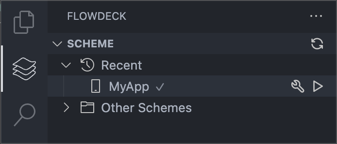

## Building from the Scheme Panel

Open the FlowDeck panel → Schemes and use the scheme actions:

- <Icon icon="hammer" /> **Build** - Compile your app
- <Icon icon="play" /> **Build and Run** - Compile and launch your app

## Building from Command Palette

Build commands are also available via the Command Palette:

- `⌘⇧P` → `FlowDeck: Build`
- `⌘⇧P` → `FlowDeck: Build and Run`

## Keyboard Shortcuts

FlowDeck provides default keyboard shortcuts for common build operations:

- **Build**: `⌘B`
- **Build and Run**: `⌘R`
- **Clean Build**: `⌘⇧K`

## Build Configurations

Select different build configurations (Debug/Release) using:

1. Click the configuration selector in the status bar
2. Use `FlowDeck: Select Configuration` command
3. Choose Debug or Release mode

## Advanced Configuration

For advanced build configurations and custom build tasks, see [Build Tasks Configuration](/advanced/tasks-json).

<Tip>
  Press `⌘⇧B` to quickly set up your first build task. FlowDeck will create the necessary configuration files automatically.
</Tip>