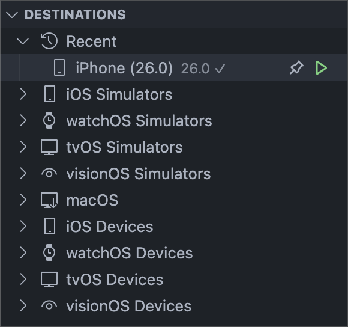

FlowDeck provides seamless integration with iOS simulators directly within VS Code, allowing you to manage and interact with simulators without switching to Xcode.

## Simulator Selection

Select a simulator as your build destination:

1. Use the `FlowDeck: Select Destination` command
2. Choose your simulator from the list
3. Build and run your app on the selected simulator

<Tip>
  You can also right-click the simulator in FlowDeck's devices panel and select **Select destination**
</Tip>

FlowDeck's simulator panel provides quick access to simulator commands:

- <Icon icon="map-pin" /> **Select Simulator** - Set as build destination
- <Icon icon="play" /> **Start Simulator** - Boot the simulator
- <Icon icon="stop" /> **Stop Simulator** - Shut down the simulator

## Available Commands

FlowDeck provides the following simulator commands via the Command Palette:

| Command | Description |
|---------|-------------|
| Start Simulator | Boot a specific simulator |
| Stop Simulator | Shut down a running simulator |
| Open Simulator | Launch the Simulator application |
| Remove Simulator Cache | Clear simulator caches |

## Managing Simulators

<Note>
  FlowDeck does not currently support adding or removing simulator runtimes. This feature is coming soon.
</Note>